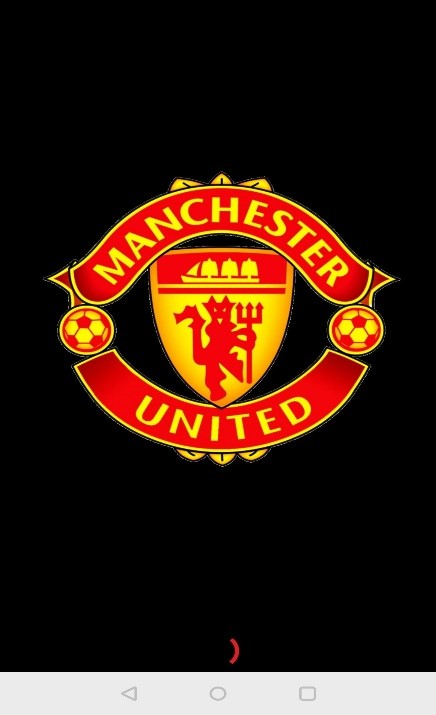

# ManchesterUnitedTeamList

<b>App Name</b>
 

<b>Manchester United Team List</b>

<b>Contents</b>

| Content |	Description |
| ------- | ----------- |
| Activity 1 | Splash Screen |
| Activity 2 | Player List (Custom List) |
| Activity 3 | General Player Information |
| Activity 4 | Manchester United Store WebView |
| Activity 5 | Player Statistics |
| Activity 6 | Web View to display additional info about the player |
| Additional Specifications |	Youtube App, Title Bar, App Icon |

 

<b>Activity 1</b>

          
<b>Splash Screen</b>
 
  <b>A) User Interface:</b> 
  
  
  
B) Functionality:
        
