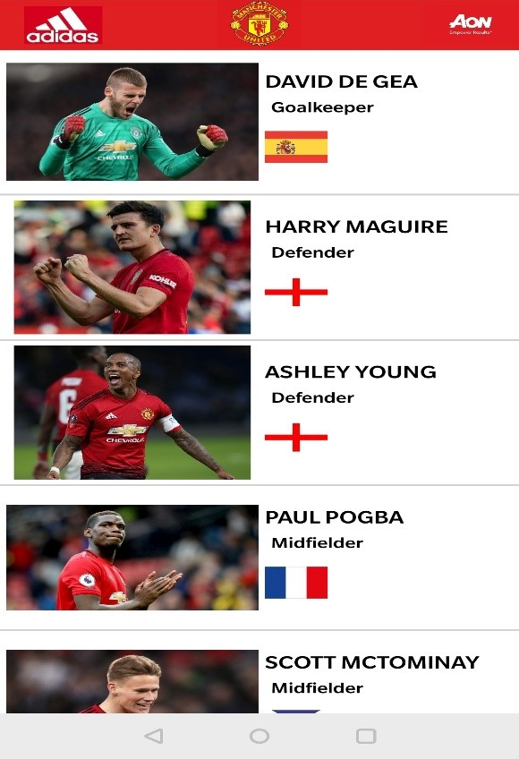
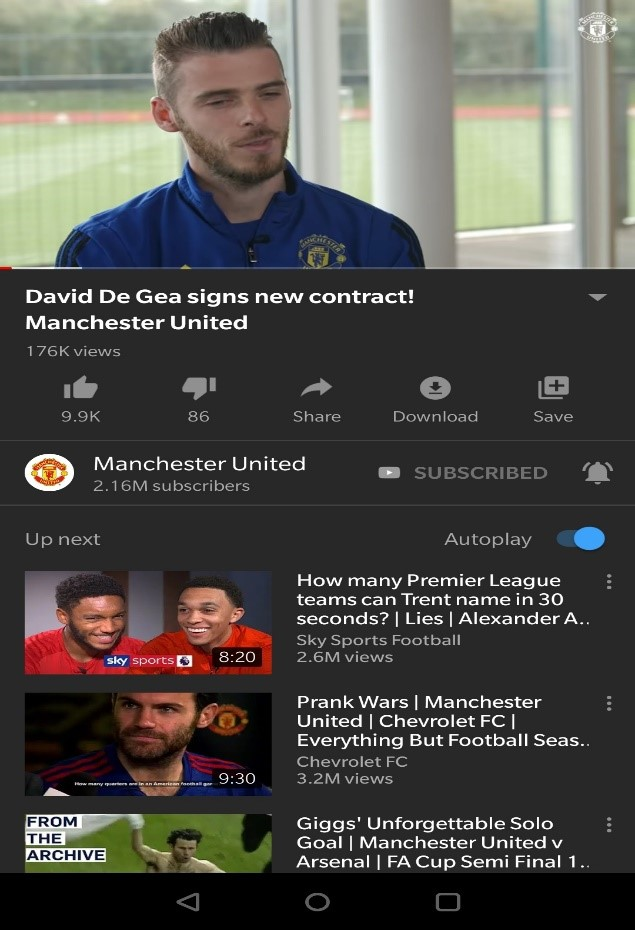

# Manchester United Team List

<b>App Name</b>
 

<b>Manchester United Team List</b>

<b>Contents</b>

| Content |	Description |
| ------- | ----------- |
| Activity 1 | Splash Screen |
| Activity 2 | Player List (Custom List) |
| Activity 3 | General Player Information |
| Activity 4 | Manchester United Store WebView |
| Activity 5 | Player Statistics |
| Activity 6 | Web View to display additional info about the player |
| Additional Specifications |	Youtube App, Title Bar, App Icon |

 

<b>Activity 1</b>

          
<b>Splash Screen</b>
 
  <b>A) User Interface:</b> 
  
</img>
 
  
<b>B) Functionality:</b> 

The Splash Screen will open as the Launcher Activity and load for 4 seconds before redirecting to the second activity ie the Custom List.

 
<b>C) Personal Contribution:</b> 

      
•	Added Manchester United logo to give a good look and feel to the app. 
•	Added a progress bar on screen to let the user know that the app is loading  
•	Added finish() function which will not allow the user to load the Splash Screen Activity on hitting the back button from               Activity 2 i.e. Splash Screen will load only once per launch of the app.  
 

 
  
 
<b>Activity 2</b>

          
<b>Player List(Custom List)</b>
 
  <b>A) User Interface:</b> 
  
</img>
 
  
<b>B) Functionality:</b> 

This Activity consists of a custom list of the Manchester United team players. The list contains images of players, their names, their positions and their nationality using national flags of their respective countries. The list of players (Player Image, Name, Position, Flag) is being populated from XML file (player_data.xml) using XML parsing and being stored in objects using model class. The list is scrollable. To view info of a player, the user can click on the list item of the respective player and he will be directed to Activity 3.

 
<b>C) Personal Contribution:</b> 

      
•	The interface of the list is user-friendly. User can easily scroll down the list and pick the player of his/her choice whose additional info they would like to view.  
•	All the images are stored in the assets folder and accessed through the AssetManager Class.  
•	Tried to make the list similar to the player list displayed in the Fantasy Premiere League App.  
•	The Item On Click Listener will redirect the user to the exact Player Info activity page of the player on which the user has clicked and intends to view more info of the respective player.  

 

 

<b>Activity 3</b>

          
<b>General Player Information</b>
 
  <b>A) User Interface:</b> 
  
</img>
 
  
<b>B) Functionality:</b> 

This Activity consists of general information of the player that the user selected from the Activity 2 i.e. the custom list. It lists general info such as the Player Ratings denoted by the golden stars (ratings out 5 starts), Country of Birth, National Team, Age, Date of Birth, Premiere League Debut, Appearances and Goals. It consists of a play video button that will play some video related to that player in the Youtube app. There is a buy now button, that will redirect the user to the official Manchester United Shop website (opened in a webview in app) to buy the player jersey. The details of player and the links to the play video and buy buttons are parsed from XML. On clicking the Stats button, the user will be directed to Activity 4 to view the player stats of that player.

 
<b>C) Personal Contribution:</b> 

      
•	Play Video Button: When user clicks on the play video button, a video will be played in the Youtube App. On clicking back button user can go back from Youtube App to the Main App.  
•	Buy Now Button: When user clicks on the buy now button, he/she will be redirected to the official Manchester United Shop website and view the Player jersey as displayed on the app screen. The Website will open in a webview which is another additional activity that I have added. User can directly buy the jersey from this webview and if he wishes to explore other kit options from the shop he can do so by navigating the website.   
•	Added a Scroll view to fit the text below “Personal Information” to fit in devices with smaller screens. If the user is having a small dimension screen, the button or some info will be missing if a scroll view is not added, to overcome this I have added a scroll view.  
•	The design of the activity is consistent and smooth to give a simple and user-friendly experience to the users.  

 

  
 
 
<b>Activity 4</b>

          
<b>Manchester United Store WebView</b>
 
  <b>A) User Interface:</b> 
  
</img>
 

<b>C) Personal Contribution:</b> 

      
•	The Buy Now button in Activity 3 will redirect the user to the additional activity (ShopWebView) which is a webview and will open the official Manchester United Store website and display the respective player’s kit page with the kit specs and buy now option.  
•	The links to the official kits are all parsed through the XML parser and declared in the XML file (player_data.xml).  

 

  
 
 
<b>Activity 5</b>

          
<b>Player Statistics</b>
 
  <b>A) User Interface:</b> 
  
</img>
 
  
<b>B) Functionality:</b> 

          This Activity displays some more information about the player. It displays the player statistics and player image. The more info button redirects the user to Activity 6.

 
<b>C) Personal Contribution:</b> 

      
•	The design of the activity is consistent and smooth to give a simple and user-friendly experience to the users.  
•	Displays a range of stats about the player through XML parsing.  

 

 

<b>Activity 6</b>

          
<b>Web View to display additional info about the player</b>
 
  <b>A) User Interface:</b> 
  
</img>
 
  
<b>B) Functionality:</b> 

         This Activity consists of a Web View that will embed and open the official Manchester United website and display the respective player’s information in it.

 
<b>C) Personal Contribution:</b> 

      
•	The links provided are accurate and will open the player info page of the respective player in the webview.  
•	The links are parsed through the XML parser and declared in the XML file (player_data.xml).  

 

 

<b>Additional Specifications</b>

  
        
  <b>A) Youtube Integration</b> 
          •	<b>User Interface:</b> 
            
</img>
 
            •	<b>Personal Contribution:</b>   
o	The Play Video Button in Activity 3 will redirect the user to the youtube app and will play a video of the respective player. 
o	The links of the youtube videos are all parsed through the XML parser and declared in the XML file (player_data.xml).

          <b>B)	Title Bar: </b> 
•	User Interface:  
           
</img>
 
           •	<b>Personal Contribution:</b>  
o	The title bar consists of a relative layout in which I have added a Text View and 3 Image Views (Addidas logo, Manchester United Logo, Aon Logo). I have aligned the layouts as shown in the screenshot using the align functionalities available under the relative layout for eg, layout_toRightof, layout_toLeftof etc. The title bar gives a good look and feel to the app.  

          <b>C) Logo/App Icon</b> 
          •	User Interface: 
          
</img>
 
          •	<b>Personal Contribution:</b>  
o	  Changed the app icon in the AndroidManifest.xml file. The   
  logo image is shown above. Changed the image for
  android:icon and android:roundIcon with above image.

          
 

 
 
 
